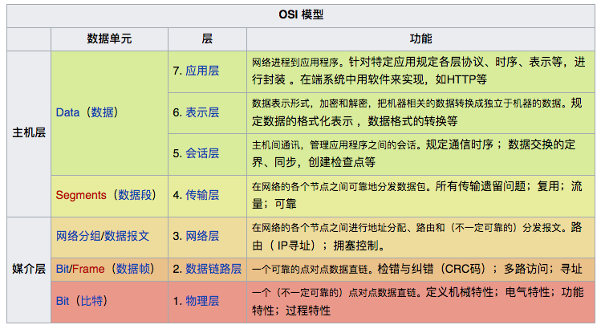

# OSI 七层网络模型
从下往上依次是：物理层、数据链路层、网络层、传输层、会话层、表示层、应用层


# TCP/IP四层网络模型
从下往上依次为：链路层、网络层、传输层、应用层

# Http协议
HTTP通信机制是在一次完整的HTTP通信过程中，Web浏览器与Web服务器之间将完成下列7个步骤：

（1）建立TCP连接

在HTTP工作开始之前，Web浏览器首先要通过网络与Web服务器建立连接，该连接是通过TCP来完成的，该协议与IP协议共同构建Internet，即著名的TCP/IP协议族，因此Internet又被称作是TCP/IP网络。HTTP是比TCP更高层次的应用层协议，根据规则，只有低层协议建立之后才能，才能进行更层协议的连接，因此，首先要建立TCP连接，一般TCP连接的端口号是80

（2) Web浏览器向Web服务器发送请求命令

一旦建立了TCP连接，Web浏览器就会向Web服务器发送请求命令

例如：GET/sample/hello.jsp HTTP/1.1

（3) Web浏览器发送请求头信息

浏览器发送其请求命令之后，还要以头信息的形式向Web服务器发送一些别的信息，之后浏览器发送了一空白行来通知服务器，它已经结束了该头信息的发送。

（4）Web服务器应答
客户机向服务器发出请求后，服务器会客户机回送应答，

HTTP/1.1 200 OK

应答的第一部分是协议的版本号和应答状态码

（5) Web服务器发送应答头信息

正如客户端会随同请求发送关于自身的信息一样，服务器也会随同应答向用户发送关于它自己的数据及被请求的文档。

（6) Web服务器向浏览器发送数据

Web服务器向浏览器发送头信息后，它会发送一个空白行来表示头信息的发送到此为结束，接着，它就以Content-Type应答头信息所描述的格式发送用户所请求的实际数据

（7) Web服务器关闭TCP连接
一般情况下，一旦Web服务器向浏览器发送了请求数据，它就要关闭TCP连接，然后如果浏览器或者服务器在其头信息加入了这行代码

Connection:keep-alive

TCP连接在发送后将仍然保持打开状态，于是，浏览器可以继续通过相同的连接发送请求。保持连接节省了为每个请求建立新连接所需的时间，还节约了网络带宽。

## http请求
下面是一个HTTP请求的例子：

```
    GET/sample.jspHTTP/1.1
    Accept:image/gif.image/jpeg,*/*
    Accept-Language:zh-cn
    Connection:Keep-Alive
    Host:localhost
    User-Agent:Mozila/4.0(compatible;MSIE5.01;Window NT5.0)
    Accept-Encoding:gzip,deflate
 
    username=mj&password=019283
```

http请求组成包括：请求行、消息报头、请求正文

1. 请求行以一个方法符号开头，以空格分开，后面跟着请求的URI和协议的版本，格式如下：Method Request-URI HTTP-Version CRLF

其中 Method表示请求方法；Request-URI是一个统一资源标识符；HTTP-Version表示请求的HTTP协议版本；CRLF表示回车和换行（除了作为结尾的CRLF外，不允许出现单独的CR或LF字符）。

请求方法（所有方法全为大写）有多种，各个方法的解释如下：

GET     请求获取Request-URI所标识的资源

POST    在Request-URI所标识的资源后附加新的数据

HEAD    请求获取由Request-URI所标识的资源的响应消息报头

PUT     请求服务器存储一个资源，并用Request-URI作为其标识

DELETE  请求服务器删除Request-URI所标识的资源

TRACE   请求服务器回送收到的请求信息，主要用于测试或诊断

CONNECT 保留将来使用

OPTIONS 请求查询服务器的性能，或者查询与资源相关的选项和需求

2. 请求头包含许多有关的客户端环境和请求正文的有用信息。例如，请求头可以声明浏览器所用的语言，请求正文的长度等。

3. 请求正文、请求头和请求正文之间是一个空行，这个行非常重要，它表示请求头已经结束，接下来的是请求正文。请求正文中可以包含客户提交的查询字符串信息

## http响应
在接收和解释请求消息后，服务器会返回一个 HTTP 响应消息。与 HTTP 请求类似，HTTP 响应也是由三个部分组成，分别是：状态行、消息报头和响应正文。如：

```xml
HTTP/1.1 200 OK
Date: Sun, 17 Mar 2013 08:12:54 GMT
Server: Apache/2.2.8 (Win32) PHP/5.2.5
X-Powered-By: PHP/5.2.5
Set-Cookie: PHPSESSID=c0huq7pdkmm5gg6osoe3mgjmm3; path=/
Expires: Thu, 19 Nov 1981 08:52:00 GMT
Cache-Control: no-store, no-cache, must-revalidate, post-check=0, pre-check=0
Pragma: no-cache
Content-Length: 4393
Keep-Alive: timeout=5, max=100
Connection: Keep-Alive
Content-Type: text/html; charset=utf-8


<html>
<head>
<title>HTTP响应示例<title>
</head>
<body>
Hello HTTP!
</body>
</html>
```

1. 状态行

状态行由协议版本、数字形式的状态代码，及相应的状态描述组成，各元素之间以空格分隔，结尾时回车换行符，格式如下：

HTTP-Version Status-Code Reason-Phrase CRLF

HTTP-Version 表示服务器 HTTP 协议的版本，Status-Code 表示服务器发回的响应代码，Reason-Phrase 表示状态代码的文本描述，CRLF 表示回车换行。例如：

HTTP/1.1 200 OK (CRLF)

2. 响应正文

响应正文就是服务器返回的资源的内容，响应头和正文之间也必须用空行分隔。如：
```xml
    <html>  
    <head>  
        <title>HTTP响应示例<title>  
    </head>  
    <body>  
        Hello HTTP!  
    </body>  
    </html>  

```

3. 响应头信息

Cache头域


## 缓存
浏览器缓存：包括页面html缓存和图片js，css等资源的缓存。

1、缓存的优点：

1）服务器响应更快：因为请求从缓存服务器（离客户端更近）而不是源服务器被相应，这个过程耗时更少，让服务器看上去响应更快。

2）减少网络带宽消耗：当副本被重用时会减低客户端的带宽消耗；客户可以节省带宽费用，控制带宽的需求的增长并更易于管理。

2、缓存工作原理

页面缓存状态是由http header决定的，一个浏览器请求信息，一个是服务器响应信息。主要包括Pragma: no-cache、Cache-Control、 Expires、 Last-Modified、If-Modified-Since。其中Pragma: no-cache由HTTP/1.0规定，Cache-Control由HTTP/1.1规定。

### Cache-Control策略
Cache-Control优先级高于Expires

HTTP-Header中的Cache-Control字段可以是public、private、no-cache、no- store、no-transform、must-revalidate、proxy-revalidate、max-age。


public指示响应可被任何缓存区缓存。

private指示对于单个用户的整个或部分响应消息，不能被共享缓存处理。这允许服务器仅仅描述当用户的部分响应消息，此响应消息对于其他用户的请求无效。

no-cache指示请求或响应消息不能缓存

no-store用于防止重要的信息被无意的发布。在请求消息中发送将使得请求和响应消息都不使用缓存。

max-age指示客户机可以接收生存期不大于指定时间（以秒为单位）的响应。

min-fresh指示客户机可以接收响应时间小于当前时间加上指定时间的响应。

max-stale指示客户机可以接收超出超时期间的响应消息。如果指定max-stale消息的值，那么客户机可以接收超出超时期指定值之内的响应消息。

### 需配合Cache-Control使用的字段


## http状态码
HTTP状态码共分为5种类型：

1** 	信息，服务器收到请求，需要请求者继续执行操作

2** 	成功，操作被成功接收并处理

3** 	重定向，需要进一步的操作以完成请求

4** 	客户端错误，请求包含语法错误或无法完成请求

5** 	服务器错误，服务器在处理请求的过程中发生了错误


# WebSocket
WebSocket一种在单个 TCP 连接上进行全双工通讯的协议。

WebSocket 使得客户端和服务器之间的数据交换变得更加简单，允许服务端主动向客户端推送数据。在 WebSocket API 中，浏览器和服务器只需要完成一次握手，两者之间就直接可以创建持久性的连接，并进行双向数据传输。

## 优点

* 较少的控制开销。在连接创建后，服务器和客户端之间交换数据时，用于协议控制的数据包头部相对较小。在不包含扩展的情况下，对于服务器到客户端的内容，此头部大小只有2至10字节（和数据包长度有关）；对于客户端到服务器的内容，此头部还需要加上额外的4字节的掩码。相对于HTTP请求每次都要携带完整的头部，此项开销显著减少了。

* 更强的实时性。由于协议是全双工的，所以服务器可以随时主动给客户端下发数据。相对于HTTP请求需要等待客户端发起请求服务端才能响应，延迟明显更少；即使是和Comet等类似的长轮询比较，其也能在短时间内更多次地传递数据。

* 保持连接状态。于HTTP不同的是，Websocket需要先创建连接，这就使得其成为一种有状态的协议，之后通信时可以省略部分状态信息。而HTTP请求可能需要在每个请求都携带状态信息（如身份认证等）。

* 更好的二进制支持。Websocket定义了二进制帧，相对HTTP，可以更轻松地处理二进制内容。

* 可以支持扩展。Websocket定义了扩展，用户可以扩展协议、实现部分自定义的子协议。如部分浏览器支持压缩等。

* 更好的压缩效果。相对于HTTP压缩，Websocket在适当的扩展支持下，可以沿用之前内容的上下文，在传递类似的数据时，可以显著地提高压缩率。


# Reference

http://www.studytonight.com/computer-networks/osi-model-physical-layer